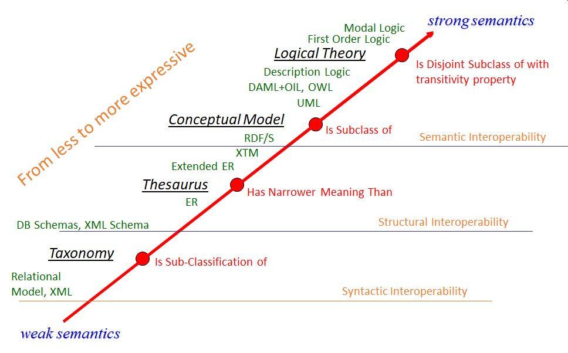

# EIFFEL Ontology Documentation Page 

---

## Overview

This documentation explores in detail the PIXEL Ontology Tools as one of the main components of the EIFFEL architecture. To access the EIFFEL project website, click [here](https://www.eiffel4climate.eu/).

> *EIFFEL aims at revealing the Role of GEOSS as the Default Digital Portal for Building Climate Change Adaptation & Mitigation Applications.*

H2020 project EIFFEL is a game changer in the domain of **climate change adaptation and mitigation** by harvesting the benefits of the **GEOSS data**. The project will offer to the Earth Observation community the ground-breaking capacity of exploiting existing GEOSS datasets and will also build upon prior knowledge, with minimal new data collection activities. Added-value services interoperable with GEOSS will be designed, using **cognitive search and metadata augmentation tools** based on Artificial Intelligence, including **Natural Language Processing**. These tools will leverage advanced cognitive features to extract meaningful information from and enrich GEOSS metadata.

EIFFEL has been financed by the **EU Horizon 2020 research and innovation programme** under Grant Agreement No 101003518  

  

## Semantic concepts and ontology spectrum

The term ontology comes from the field of philosophy and relates to the study of being and existence. In computer science, it was first adopted from Artificial Intelligence (AI) researchers in the 1980’s who anticipated its potential for building **computational models** and allowing some sort of **automated reasoning**. One decade later, interoperability issues among emerging technologies and platforms introduced an **ontology layer** as a standard component of knowledge systems.Typically, in computer science the term ontology is defined as an explicit specification of a shared conceptualization. In other words:

   - The ontology defines basically the **concepts and relationships** among them within a particular **domain** (specific subject or area of knowledge).
   - The specification takes the form of a **set of classes** (representing the concepts) with a **set of properties** (represented by the properties of each class)
 

The **ontology spectrum** describes a range of semantic models of increasing expressiveness and complexity: 

   - Less structured models: **taxonomies** (e.g., UNSPSC), database schemas (e.g., SQL schema) and metadata schemes (e.g., WSDL)
   - Structured models: **thesauri** (e.g., WordNet) and conceptual models (e.g. UML)
   - High structured models: **logical theories** (e.g., Ontolingua, semantic web)

Ontologies are normally developed by a team with two main profiles:

   - **Domain experts**: have the knowledge of a specific domain
   - **Modellers/ontologists**: know how to model a new domain, build the semantic properties, create individuals, link with other domains, etc.

The main **key benefit** provided by ontologies refers to **intelligent searches**. By means of ontologies, users can organize the information in a way so that **software agents (machines) can understand and interpret the meaning**; therefore, they might be able to search and integrate data in a much better and powerful way. As the meaning is somehow stored in the ontology, applications can automatically extract data from web pages (e.g., in a semantic web environment), process them and make their own decisions.

Basically, you need more than a conceptual model –typically understood by human beings - if you need machine interpretability (more than machine-processing). Logical theories come in place as strong ontologies, which can be:

   - **Frame-based**: focussed on the entities (like OO modelling), which includes the logical expressions, properties, relations and constraints/rules.
   - **Axiomatic**: not centred on the entities, but rather on the axioms/rules referring to the entities allowing a more distributed approach.

  

## Architecture for Semantic Web Applications

   
A typical semantic web deployment requires the following modules:

 - **RDF Parser**: it is able to read text in one or more of the previous RDF formats and interpret them as triples. The **RDF serializer** makes the opposite.
 - **RDF store**: it is a database with the ability to store and retrieve data in the form of triples, also with the ability to merge multiple data sources.
 - **RDF query engine**: it is associated with the RDF store and allows to retrieve RDF data in form of structured queries. SPARQL, standardized by the W3C, is the most common query language.
 - **Application**: it performs some processing with the RDF data, typically obtained from a RDF store via RDF queries.
 - **Reasoning engine**: this module is able to reason and infer logical consequences from RDF data or RDF schemas. Reasoning declarations, or part of them, can be expressed in the RDF query language and therefore the reasoning engine can be part of the RDF database. In other environments, the reasoning engine can also be used as a library by/within the Application.

Before the appearance of NO-SQL databases, W3C provided recommendations, such as Direct Mapping (**DM**) and Relational to RDF Markup Language (**R2RML**) to assist in the mapping of a table to RDF and avoid ambiguities or guesses. 
Currently the concept of RDF store can easily be ported to the web, as many HTML pages include structured information (e.g., contact information, opening hours, ratings, prices, etc.). This capability of embedding structured data in web pages is called **rich snippet** (vs. plain snippet), and can be really helpful in searches (e.g., to decide for a restaurant among others). Common ways to embed data in HTML web pages are **Microdata** (Schema.org), **RDFa** (W3C) and **JSON-LD**. For example, Facebook uses a simplified version of RDFa to encode OGP (Open Graph Protocol) data in a web page; it allows Facebook users link to pages outside of Facebook.

Besides the way data is embedded (format), it is important to have some **shared vocabulary** for that data. **Schema.org** a joint initiative (Google, Microsoft, Yahoo) to provide shared ontologies supporting the embedding of structured data in web pages. It includes common things that you can describe in your web pages, such as Persons, Events, Organizations, Places, Ratings, etc. and binary objects (e.g., audio, video). The namespace for Schema.org is just [http://schema.org](http://schema.org) and one can use the prefix schema: for the different entities. A full analysis of the semantics of Schema.org is beyond the scope of this section, but there is plenty of related literature [6]. Schema.org’s main use is tightly coupled with Search Engine Optimization (SEO) and rich snippets, but any application can make use of it. Typically, the process follows 3 main steps:

1. Define and model your data with Schema.org
2.  Embed the data using any format (RDFa, Microdata, JSON-LD)
3. Check it with some tool: [Google Structured Data Testing Tool](https://developers.google.com/search/docs/advanced/structured-data) or [W3C RDFa distiller](https://www.w3.org/2012/pyRdfa/)

The RDF data model was designed with **data federation** in mind. The idea of federating information first (producing a federated graph) and then querying the federated information store facilitates the operational logic of the application.

  

## Linked Data

   
TBC

  

## Web Ontology Language (OWL)

   

  

 
